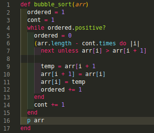
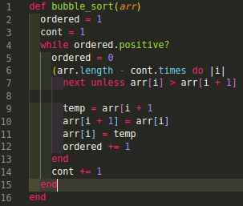
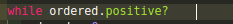
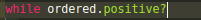
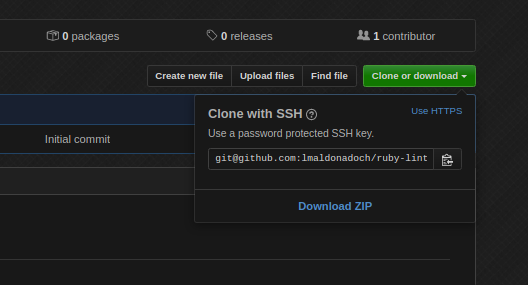
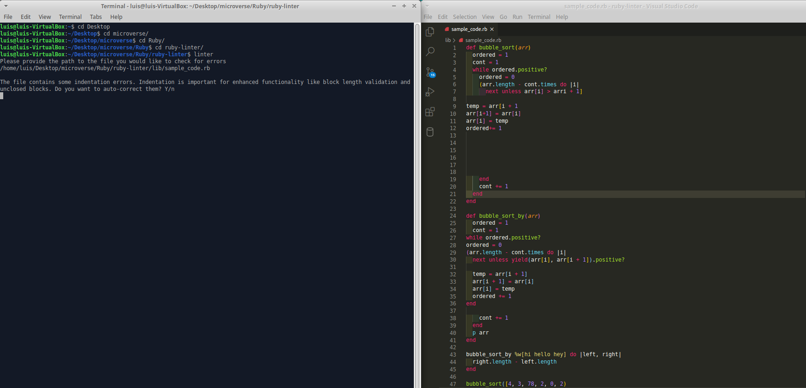
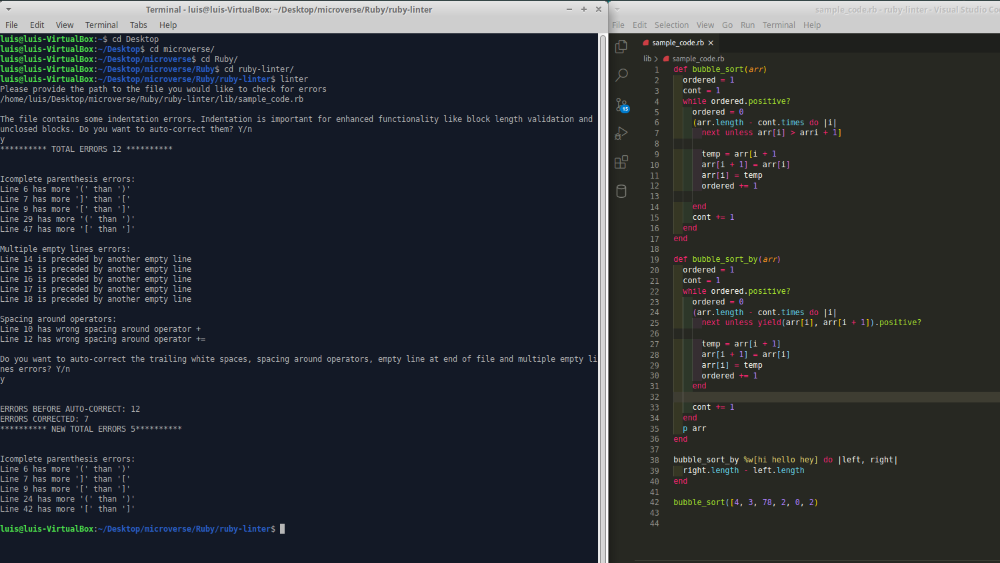
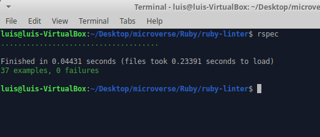

<br />
<h1 align="center"> Ruby Linter</h1>
<br />

## Index

- [Project Description](#project-description)

- [Project Structure](#project-structure)

- [Rules](#rules)

- [Instructions](#instructions)

- [Video Instructions](#video-instructions)

- [RSpec Testing](#rspec-testing)

- [Original project idea and specifications](#original-project-idea-and-specifications)

- [Tools and Knowledge](#toold-and-knowledge)

- [Author](#author)

- [Show your support](#show-your-support)

- [Acknowledgments](#acknowledgments)

- [License](#licence)

## Project Description

The project's goal was to create a Linter to use in your everyday coding life. The Linter that here is described is for use on Ruby code. It provides feedback for:

- Line length.
- Blocks length.
- Class length.
- Indentation.
- Missing parenthesis/brackets/curly brackets.
- Lines with trailing spaces.
- Multiple empty lines.
- A missing empty line at the end of the file.
- Operator spacing.
- Unclosed block.

Additional to this, the linter allows you to auto-correct most of these style issues just by typing 'y'. I decided to build this linter since I was having a lot of style issues with my Ruby projects and files. I am convinced that there is a lot to improve on the current linter options, and I would like to contribute with my design and tools to make the life of programmers better.

## Project Structure

This project includes the following files:

    ├── bin
    │   ├── linter
    └── lib
    │   ├── modules
    │   │   ├── file_validate.rb
    │   │   ├── linter_module.rb
    │   ├── errorhandler.rb
    │   └── linterclass.rb
    ├── spec
    │   ├── errorhandler_spec.rb
    │   ├── file_validate_spec.rb
    │   ├── linter_module_spec.rb
    │   ├── linterclass_spec.rb
    │   ├── spec_helper.rb
    ├── .gitignore
    ├── .rspec
    ├── .rubocop.yml
    ├── .stickler.yml
    ├── Gemfile
    ├── Gemfile.lock
    ├── README.md

- linter:
  > Contains the main executable file.
- file_validate.rb:
  > Module used to validate the file entered for evaluation is a valid file.
- linter_module.rb:
  > Provides functionality to look in strings for patterns that help determine certain mistakes. It mixes in with the String class.
- errorhandler.rb
  > Handles all the error messages and organizes them for the user to be able to find them easily.
- linterclass.rb:
  > Handles all the algorithms needed to find errors and correct them.
- Spec:
  > Folder containing all the tests by module/class with different edge cases to guaranty the correct functionality of the tool.
- .gitignore:
  > Ignores files used on development to test some edge cases.
- .rspec:
  > Helper for the tests to be able to run.
- rubocop.yml:
  > Standard Microverse style rule-set.
- Gemfile and Gemfile.lock:
  > Standard files used to run rubocop gem.
- REAME.md:
  > File containing these instructions and project structure.

## Rules

The user can easily modify the rules of:

- Line Length
- Block Length
- Class Length
- Indentation

To fit each projects specifics. In order to do it, please go to:

```
$ cd /root-project-folder/
$ cd bin
```

Or you can go through your file navigator/finder to:

/root-project-folder/bin

Open **_linter_** file using the text editor of your preference.

Customize lines 5 - 8 with your personalized style.

**_Line length (Rule set at 20)_**

> Bad code:

```
return this unless true
```

> Good code:

```
unless true
  return this
end
```

**_Blocks/Classes length (block length set to 16)_**

> Bad code:



> Good code:



**_Indentation. (indentation set to 2)_**

> Bad code:

```
def something
return true if something_else
end
```

> Good code:

```
def something
  return true if something_else
end
```

**_Missing Parenthesis/Brackets/Curly Brackets_**

> Bad code:

```
(x + y) * (z - w
```

> Good code:

```
(x + y) * (z - w)
```

**_Lines with trailing spaces_**

> Bad code:



> Good code:



**_Multiple empty lines_**

> Bad code:

```
end


if something...
```

> Good code:

```
end

if something...
```

**_A missing empty line at the end of the file_**

> Bad code:

```
end
```

> Good code:

```
end

```

**_Operator spacing_**

> Bad code:

```
(x +y)*(z- w)
```

> Good code:

```
(x + y) * (z - w)
```

**_Unclosed block_**

> Bad code:

```
def
  some awesome code


if something ...
```

> Good code:

```
def
  some awesome code
end

if something
```

# Instructions

In order to use this linter, you will need to have the repo downloaded on your local computer. To achieve that please open your Terminal and type:

```
$ cd <local file where the file will be cloned>
$ git clone git@github.com:lmaldonadoch/ruby-linter.git
```

Or you can download the zip file directly by clicking on **_Download ZIP_** file after clicking on the **_Clone or Download_** button.



Once the folder is on your computer, please go to the root directory by typing the next command:

```
$ cd ruby-linter
```

Here, you can create an alias/softlink for the file so that you can run it from the root directory. To do that, please type the next commands:

**_On windows/Mac_**

```
$ ln -s $PWD/linter /usr/local/bin/

```

**_On Linux_**

```
$ sudo ln -s $PWD/linter /usr/local/bin/
```

Then you can run the file from the root directory

```
$ cd ruby-linter
$ linter

Please provide the path to the file you would like to check for errors

$ <path to file>

```

If you would not like to create an alias/softlink then you can just go into the bin folder and then run the linter like this:

```
$ cd ruby-linter
$ cd bin
$ ruby linter

Please provide the path to the file you would like to check for errors

$ <path to file>

```

You can get the **_path to file_** by going to your file directory and copying the path, or on your code editor right click on the file and then **_Copy Path_**. Then follow the instructions provided by the linter.

> **_Please [click here](https://www.loom.com/share/8ed1daec5d5d4845927a308a59c7326c) to view the video instructions._**

Here are some screenshots on how it works:



> Notice the indentation errors on lines 9 through 12 and 27 through 36. The first thing linter will show is is the indentation errors since some enhanced functionality depend on the correct indentation of the file. After we select 'y' to auto correct, this is what linter shows:


> Notice the indentation is corrected, and now it shows us the style/functionality errors we are incurring in our code. The linter then gives us an option to correct automatically some of these issues for us.



> After we select 'y' to autocorrect, notice how the style issues got corrected, and the functionality issues are kept so that the user can decide whether they are functionality issues or the mismatch was on purpose.

# Video instructions

Please [click here](https://www.loom.com/share/e74fb588c8204a2c99ffc721366cb901) to view the video instructions.

# RSpec Testing

The code was tested using RSpec. If you would like run the tests yourself please make sure you have RSpec installed on your local machine. To verify it you can open your terminal and type:

```

\$ rspec --version

```

If it does not show you a version of RSpect then please run the following command

```

\$ gem install rspec

```

To run the tests please go to the root file of the repo and run

```

\$ rspec

```

And the tests should show this:



If you would like to customize the tests, please type on your terminal:

```

\$ cd spec

```

And open the file you would like to run custom tests on.

# Original project idea and specifications

Please [click here](https://www.notion.so/microverse/Build-your-own-linter-b17a3c22f7b940c98ca1980250720769) to see the project specifics.

# Tools and Knowledge

- Ruby
- VS Code
- RSpec gem
- Rubocop gem
- Stickler CI
- OOP (Object Oriented Programming) principles
- Classes and Modules

## Author

👤 **Luis Angel Maldonado**

- Github: [@lmaldonadoch](https://github.com/lmaldonadoch)
- Twitter: [@LuisAngelMCh](https://twitter.com/LuisAngelMCh)
- Linkedin: [lmaldonadoch](https://www.linkedin.com/in/luis-angel-maldonado-5b503a1a3/)
- Potfolio: [www.lmaldonadoch.com](http://www.lmaldonadoch.com/)

## Future Upgrades

- Add a validation for conditionals, always use && over 'and', and || over 'or'.
- Add a validation for conditionals to warn users of miss-use of = signs when == is more appropriate.
- Make a Ruby Gem from my lint.

Contributions, issues and feature requests are welcome!

## 🤝 Contributing

Contributions, issues and feature requests are welcome!

Feel free to check the [issues page](https://github.com/lmaldonadoch/ruby-linter/issues).

## Show your support

Give a ⭐️ if you like this project!

## Acknowledgments

- Project inspired by Microverse Program. Please [click here](https://www.notion.so/microverse/Build-your-own-linter-b17a3c22f7b940c98ca1980250720769) to see the original project specifications.

## License

This project is [MIT](lic.url) licensed.

```

```
